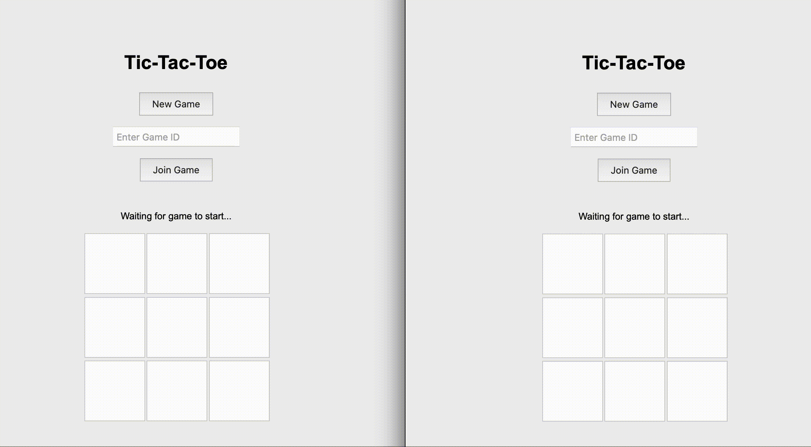

# realtime-tictactoe

This is a simple Tic-Tac-Toe game implemented using WebSockets and containerized with Docker.



## Prerequisites

- Docker
- Docker Compose

## Running the Game

1. Clone this repository to your local machine.

2. Navigate to the project directory in your terminal.

3. Build and start the containers using Docker Compose:

   ```
   docker-compose up --build
   ```

4. Once the containers are running, open a web browser and go to:

   ```
   http://localhost:8000
   ```

5. To start a new game, click the "New Game" button. You will see a Game ID displayed.

6. To join an existing game, enter the Game ID in the input field and click "Join Game".

7. To play the game from two different browsers or devices, open the URL on another browser or device and join the game using the Game ID.

8. The game will display whether you are player 'X' or 'O'.

9. Players take turns clicking on the cells to make their moves. The game automatically updates for both players.

10. When the game ends (win or tie), the result will be displayed.

## Game Features

- Real-time updates for both players
- Display of current player ('X' or 'O') for each browser
- Automatic detection of game end (win or tie)
- No manual refresh needed - the game updates automatically

## Stopping the Game

To stop the game and shut down the containers, press `Ctrl+C` in the terminal where docker-compose is running, or run:

```
docker-compose down
```

## File Structure

- `serve.py`: WebSocket server handling game logic
- `client.py`: HTTP server serving the web page
- `index.html`: Game interface
- `Dockerfile.websocket`: Dockerfile for the WebSocket server
- `Dockerfile.http`: Dockerfile for the HTTP server
- `docker-compose.yml`: Docker Compose configuration file

Enjoy playing Tic-Tac-Toe!
